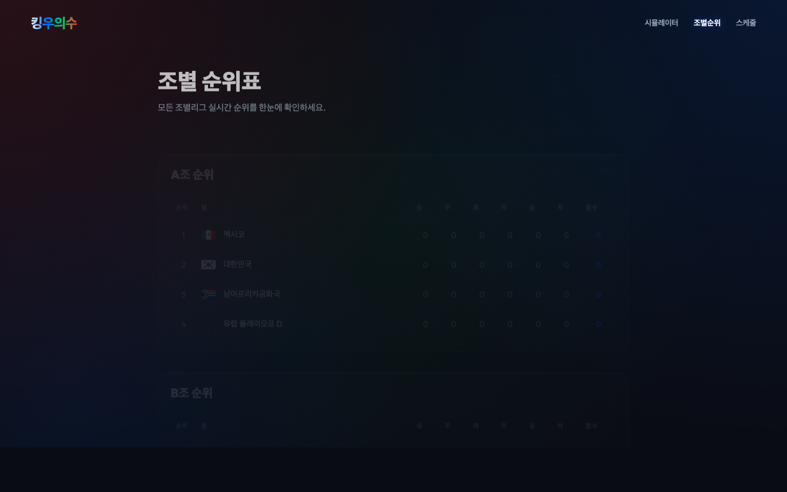
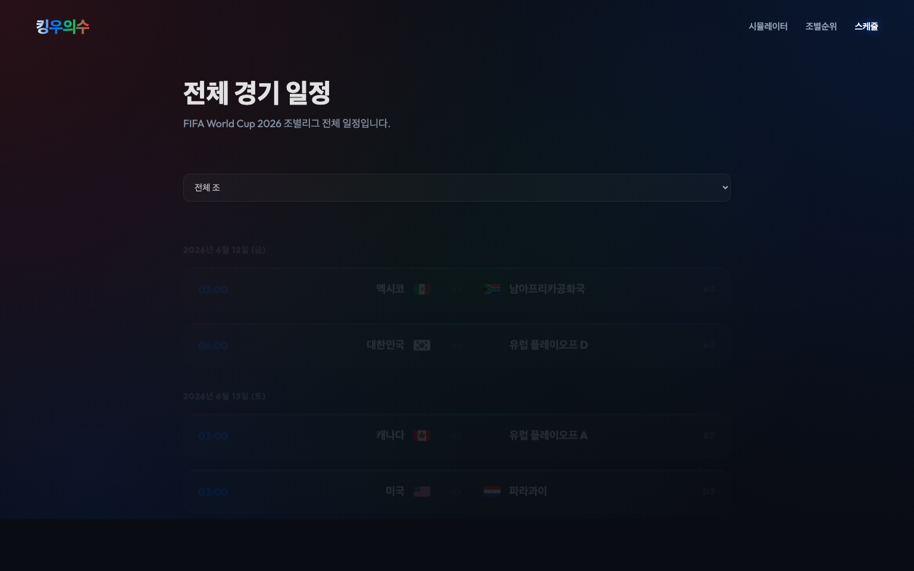

# FIFA WORLD CUP 2026 32강 경우의 수 계산기

월드컵 조별리그 결과를 직접 입력하고, 어떤 팀들이 32강에 올라가는지 바로 확인할 수 있는 서비스입니다.

## 이 서비스로 할 수 있는 것
- 경기 점수를 입력해서 조별 순위를 실시간으로 확인하기
- 3위 팀들 중 누가 올라가는지 한눈에 보기
- 자동으로 생성된 32강 대진표 확인하기
- 32강 대진표를 PNG 이미지로 다운로드하기

## 화면 구성
- **시뮬레이터**: 경기 점수 입력, 조별 순위 확인
- **조별순위**: 조별 테이블 전체 확인
- **스케줄**: 경기 일정 확인
- **32강 대진**: 최종 32강 매치업 및 3위 비교표 확인

## 사용 방법
1. 시뮬레이터에서 경기 점수를 입력합니다.
2. 경우의 수 확정 버튼으로 32강 대진 화면으로 이동합니다.
3. 필요하면 32강 대진을 이미지로 다운로드합니다.

## UI 미리보기

### 시뮬레이터

### 조별 순위

### 스케줄

### 32강 대진

