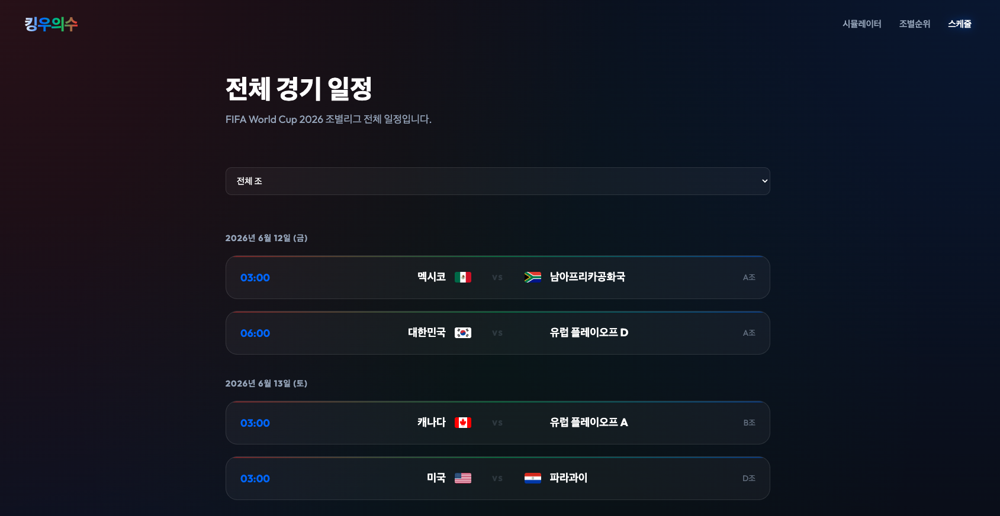
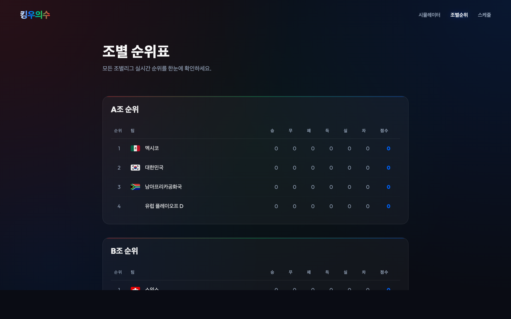
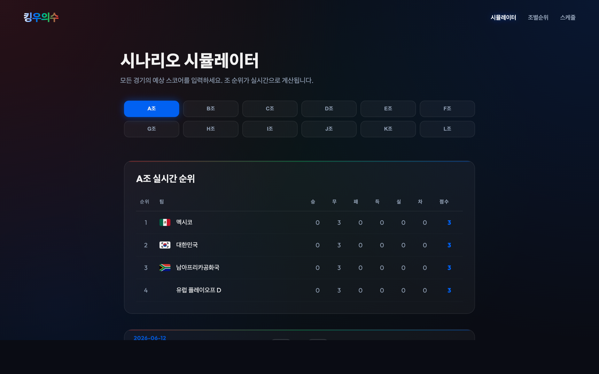
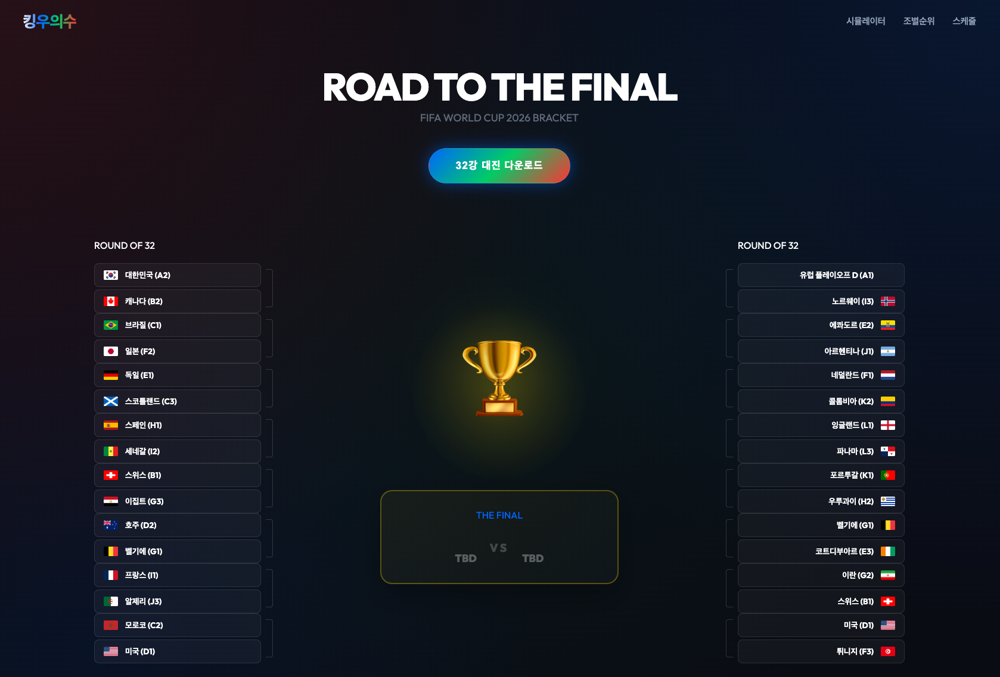
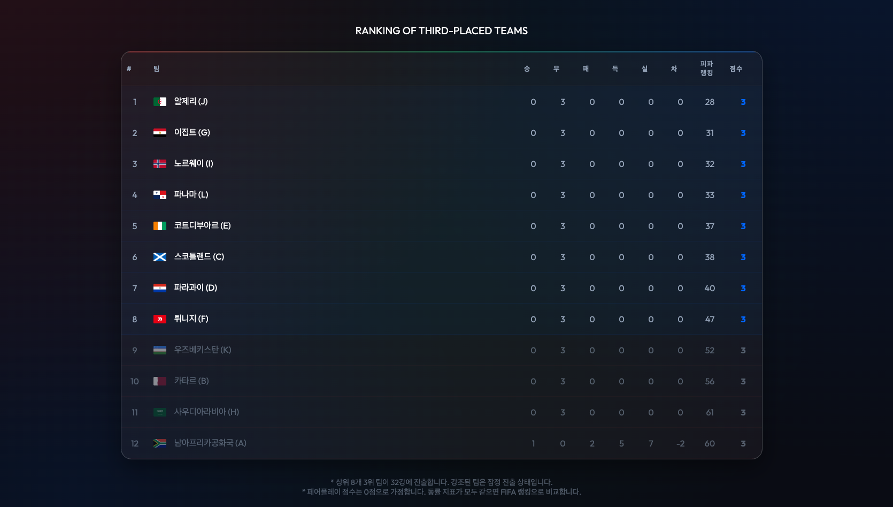

# FIFA WORLD CUP 2026 32강 경우의 수 계산기

월드컵 조별리그 결과를 직접 입력하고, 어떤 팀들이 32강에 올라가는지 바로 확인할 수 있는 서비스입니다.

## 이 서비스로 할 수 있는 것

- 경기 점수를 입력해서 조별 순위를 실시간으로 확인하기
- 3위 팀들 중 누가 올라가는지 한눈에 보기
- 자동으로 생성된 32강 대진표 확인하기
- 32강 대진표를 PNG 이미지로 다운로드하기

## 화면 구성

- **시뮬레이터**: 경기 점수 입력, 조별 순위 확인
- **조별순위**: 조별 테이블 전체 확인
- **스케줄**: 경기 일정 확인
- **32강 대진**: 최종 32강 매치업 및 3위 비교표 확인

## 사용 방법

1. 시뮬레이터에서 경기 점수를 입력합니다.
2. 경우의 수 확정 버튼으로 32강 대진 화면으로 이동합니다.
3. 필요하면 32강 대진을 이미지로 다운로드합니다.

## 경기 결과 자동 반영

Cloudflare Worker Cron은 조별리그 경기 결과 확인 시간대에만 10분 간격으로 실행됩니다.
각 경기는 `kickoffUtc` 기준 2시간 뒤부터 3시간 동안 결과 조회 대상이 됩니다.
외부 결과 소스에서 `final`/`finished`/`full_time` 상태와 스코어가 확인되면 Worker KV에 저장하고, `/data/schedule.json` 응답에 `homeScore`와 `awayScore`를 합쳐 내려줍니다.

배포 전에 Cloudflare KV namespace를 만들고 `wrangler.jsonc`의 `MATCH_RESULTS` id를 교체해야 합니다.

```bash
npx wrangler kv namespace create MATCH_RESULTS
```

`RESULT_SOURCE_URL`은 결과 조회 API 주소입니다. `{matchId}`, `{homeTeam}`, `{awayTeam}` 템플릿을 지원하며 템플릿이 없으면 쿼리 파라미터로 붙습니다.

예상 응답 예시:

```json
{
  "matchId": "A-M1",
  "status": "final",
  "homeScore": 2,
  "awayScore": 1
}
```

## UI 미리보기

### 경기 스케줄 확인



### 조별 순위 확인



### 시뮬레이션 진행 화면



### 최종 결과 화면



